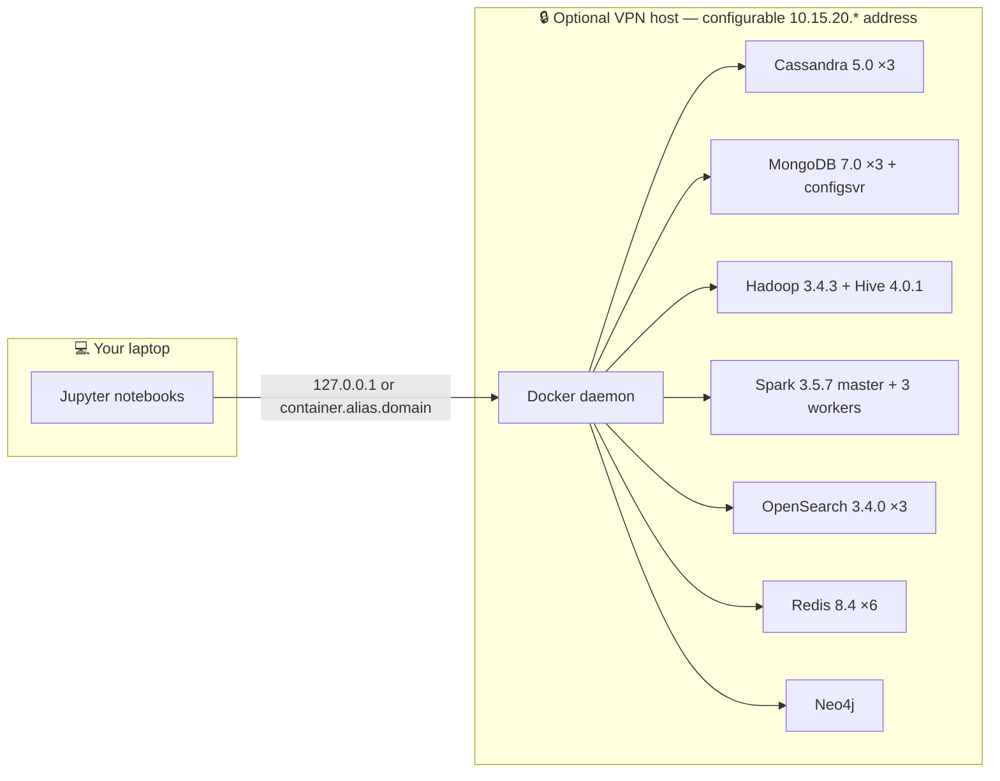
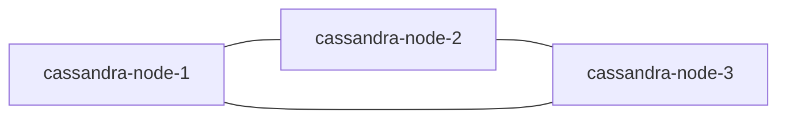
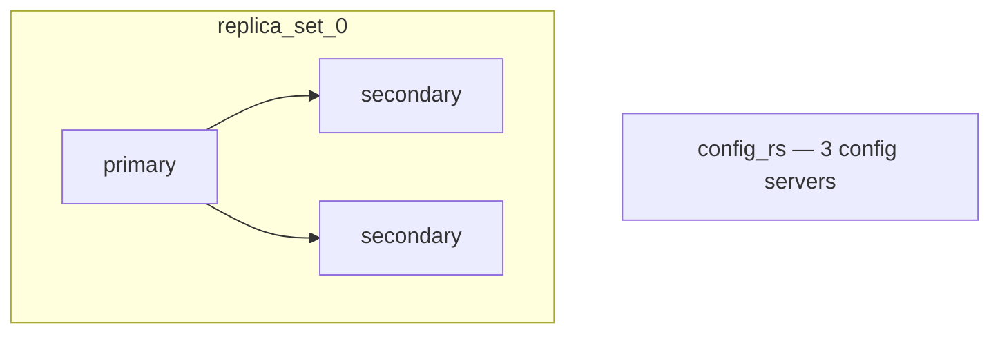
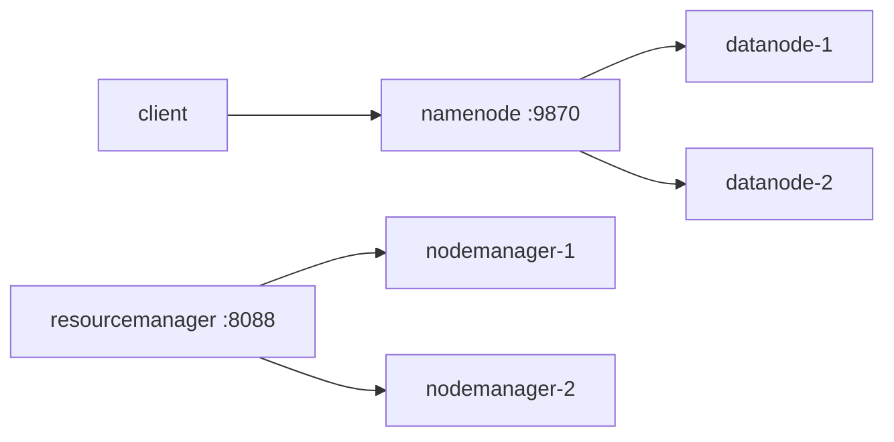
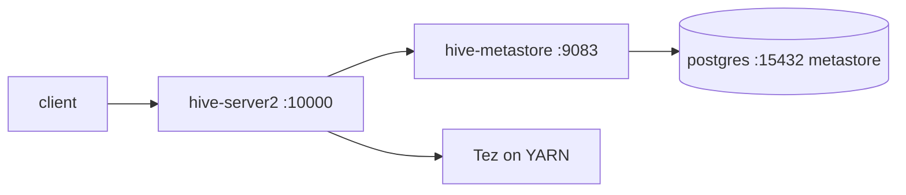
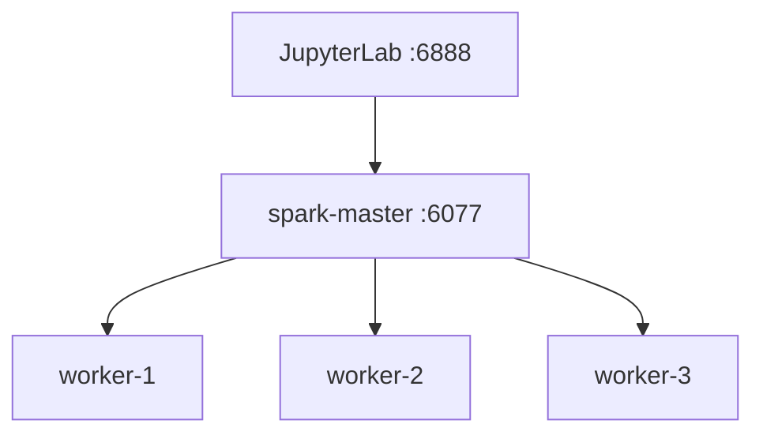
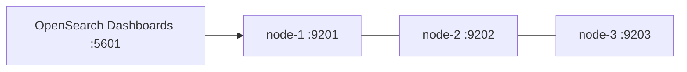
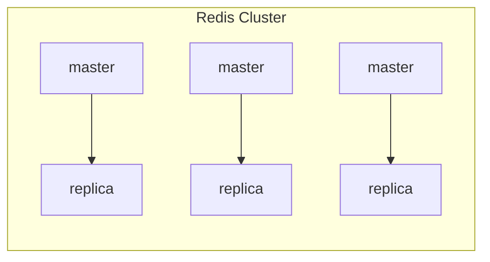

<div align="center">

# 🗄️ Non-Relational DBs — Labs Setup

**One repository. Eight distributed systems.**

Spin up **Cassandra · MongoDB · Hadoop · Hive · Spark · OpenSearch · Redis · Neo4j** as production-shaped clusters for local or VPN access from Jupyter notebooks that *generate their own* Docker Compose files.

[](https://www.python.org/)
[](https://docs.docker.com/compose/)
[](https://jupyter.org/)
[](https://docs.astral.sh/uv/)

</div>

---

## Table of contents

1. [What is this?](#what-is-this)
2. [Architecture at a glance](#architecture-at-a-glance)
3. [Environment setup](#environment-setup)
4. [Prerequisites](#prerequisites)
5. [Quickstart](#quickstart)
6. [Modules](#modules)
   - [Cassandra](#cassandra)
   - [MongoDB](#mongodb)
   - [Hadoop](#hadoop)
   - [Hive](#hive)
   - [Spark](#spark)
   - [OpenSearch](#opensearch)
   - [Redis](#redis)
   - [Neo4j](#neo4j)
7. [Network modes](#network-modes)
8. [Cluster lifecycle & cleanup](#cluster-lifecycle--cleanup)
9. [Security notes](#security-notes)
10. [Troubleshooting](#troubleshooting)
11. [Conventions & contributing](#conventions--contributing)

---

## What is this?

`labs-setup` is the hands-on companion to the **Non-Relational Databases** course. It replaces *"download this tarball, then run these forty commands"* with one repeatable pattern:

> **Every technology follows the same shape:** an `*_infra.ipynb` notebook that *programmatically builds* a `*-cluster.docker-compose.yml` and boots the cluster, and a matching `*_lab.ipynb` notebook that connects to it and teaches the fundamentals.

You never hand-edit a raw Compose file. The notebooks generate them from Python constants, so every topology, port, and credential is declared in one readable place — change the constants, re-run, and the cluster is rebuilt.

| | |
|---|---|
| **Language / tooling** | Python 3.10 · Java 17 · Jupyter · uv · Docker Compose v2 |
| **Databases & engines** | Cassandra 5.0 · MongoDB 7.0 · Hadoop 3.4.3 · Hive 4.0.1 · Spark 3.5.7 · OpenSearch 3.4.0 · Redis 8.4 · Neo4j (ubi9) |
| **Topology** | Distributed, multi-node, with Local loopback and alias-aware VPN client paths |
| **Learning model** | `infra` (deploy) → `lab` (learn) notebook pairs |

---

## Architecture at a glance

Every cluster supports two real network paths: host-side notebooks use `127.0.0.1` and published ports by default, or per-container FQDNs of the form `<container>.<VPN_CLIENT_ALIAS>.<VPN_DOMAIN>` and ports published on the configurable WireGuard address (`10.15.20.100` by default). Docker and Compose provide the infrastructure in both paths; they are not a third network mode.



### Module map

| Module | Image | Nodes | Infra notebook | Lab notebook |
|---|---|---|---|---|
| Cassandra | `cassandra:5.0` | 3 | `cassandra_infra.ipynb` | `cassandra_lab.ipynb` |
| MongoDB | `mongo:7.0` | 3 + 3 config servers | `mongodb_infra.ipynb` · `mongodb_infra_configsvr.ipynb` | `mongodb_lab.ipynb` |
| Hadoop | `apache/hadoop:3.4.3` | namenode + 2 datanodes | `hadoop_infra.ipynb` | `hadoop_lab.ipynb` |
| Hive | `apache/hive:4.0.1` + `postgres:18` | metastore + server2 | `hive_infra.ipynb` | `hive_lab.ipynb` |
| Spark | `apache/spark:3.5.7-…` + custom | master + 3 workers + JupyterLab | `spark_infra.ipynb` | `spark_lab.ipynb` |
| OpenSearch | `opensearchproject/opensearch:3.4.0` | 3 + dashboards | `opensearch_infra.ipynb` | `opensearch_lab.ipynb` |
| Redis | `redis:8.4.0-bookworm` | 6 (cluster) | `redis_infra.ipynb` | `redis_lab.ipynb` |
| Neo4j | `neo4j:ubi9` | 1 (+ APOC, GDS) | `neo4j_infra.ipynb` | `neo4j_lab.ipynb` |

---

## Environment setup

Install everything below **once**, before you clone and run the labs. Pick your operating system and follow each block. On Linux, commands are given for **Ubuntu** (`apt`) and **Fedora** (`dnf`) — the two distros most students use.

### 0. Homebrew (optional — macOS & Linux)

[Homebrew](https://brew.sh/) is a package manager for macOS (and Linux) that installs many of the tools below with one command. Several steps below list a `brew` alternative.

Install it with:

```bash
/bin/bash -c "$(curl -fsSL https://raw.githubusercontent.com/Homebrew/install/HEAD/install.sh)"
```

After install, run the `eval` line Homebrew prints at the end (it adds `brew` to your `PATH`; on Apple Silicon it lives in `/opt/homebrew`, on Intel in `/usr/local`).

> On **Linux**, Homebrew is available too, but the `apt`/`dnf` commands shown below are the recommended route — use `brew` only if you already have it.

### 1. Docker

> Runs every cluster in this course. The Docker Desktop / Docker Engine license is free for personal use and education.

<details>
<summary><b>Windows</b> (10/11, 64-bit)</summary>

1. Enable WSL 2 first. Open **PowerShell as administrator** and run:
   ```powershell
   wsl --install
   ```
   Reboot when prompted.
2. Download Docker Desktop:
   - [Docker Desktop for Windows (x64/AMD64)](https://desktop.docker.com/win/main/amd64/Docker%20Desktop%20Installer.exe)
   - [Docker Desktop for Windows (ARM64)](https://desktop.docker.com/win/main/arm64/Docker%20Desktop%20Installer.exe)
3. Run the installer. On the configuration step, keep the **WSL 2** backend (default).
4. Start **Docker Desktop** and finish the first-run wizard.
5. Verify:
   ```powershell
   docker --version
   docker compose version
   ```

</details>

<details>
<summary><b>macOS</b> (Apple Silicon or Intel)</summary>

**Option A — Homebrew (one command):**
```bash
brew install --cask docker-desktop
```

**Option B — manual download:**
1. Download Docker Desktop:
   - [Docker Desktop for Mac — Apple Silicon](https://desktop.docker.com/mac/main/arm64/Docker.dmg)
   - [Docker Desktop for Mac — Intel](https://desktop.docker.com/mac/main/amd64/Docker.dmg)
2. Open the `.dmg` and drag **Docker** into **Applications**.
3. Launch `Docker.app`, accept the license, and finish setup.
4. Verify:
   ```bash
   docker --version
   docker compose version
   ```

</details>

<details>
<summary><b>Linux — Ubuntu</b> (native Docker Engine, recommended)</summary>

Install Docker Engine + the Compose plugin from Docker's official `apt` repository:

```bash
sudo apt update && sudo apt install -y ca-certificates curl
sudo install -m 0755 -d /etc/apt/keyrings
sudo curl -fsSL https://download.docker.com/linux/ubuntu/gpg -o /etc/apt/keyrings/docker.asc
sudo chmod a+r /etc/apt/keyrings/docker.asc

sudo tee /etc/apt/sources.list.d/docker.sources > /dev/null <<'EOF'
Types: deb
URIs: https://download.docker.com/linux/ubuntu
Suites: $(. /etc/os-release && echo "${UBUNTU_CODENAME:-$VERSION_CODENAME}")
Components: stable
Architectures: $(dpkg --print-architecture)
Signed-By: /etc/apt/keyrings/docker.asc
EOF

sudo apt update
sudo apt install -y docker-ce docker-ce-cli containerd.io docker-buildx-plugin docker-compose-plugin
sudo systemctl enable --now docker
sudo usermod -aG docker "$USER"
newgrp docker
```

> Prefer the GUI? [Docker Desktop for Linux (`.deb`)](https://desktop.docker.com/linux/main/amd64/docker-desktop-amd64.deb) is the desktop alternative; the native engine above is lighter and fully supports `docker compose`.

</details>

<details>
<summary><b>Linux — Fedora</b> (native Docker Engine, recommended)</summary>

Install Docker Engine + the Compose plugin from Docker's official `dnf` repository:

```bash
sudo dnf -y install dnf-plugins-core
sudo dnf config-manager addrepo --from-repofile https://download.docker.com/linux/fedora/docker-ce.repo
sudo dnf install -y docker-ce docker-ce-cli containerd.io docker-buildx-plugin docker-compose-plugin
sudo systemctl enable --now docker
sudo usermod -aG docker "$USER"
newgrp docker
```

> Note: Docker supports the current Fedora releases (44 / 43) and the current + previous Ubuntu LTS. Prefer the GUI? [Docker Desktop for Linux (`.rpm`)](https://desktop.docker.com/linux/main/amd64/docker-desktop-x86_64.rpm) is the desktop alternative.

</details>

Verify on any OS:

```bash
docker --version        # e.g. Docker version 29.x
docker compose version  # e.g. Docker Compose version v2.x
```

### 2. Git

<details>
<summary><b>Windows</b></summary>

- Download the [Git for Windows installer (2.55.0)](https://git-scm.com/download/win) and run it (defaults are fine), **or**
  ```powershell
  winget install --id Git.Git --source winget
  ```

</details>

<details>
<summary><b>macOS</b></summary>

```bash
xcode-select --install   # Apple Command Line Tools (simplest)
# or, if you use Homebrew:
brew install git
```

</details>

<details>
<summary><b>Linux</b></summary>

```bash
# Ubuntu / Debian
sudo apt install git

# Fedora / RHEL
sudo dnf install git
```

</details>

Verify on any OS:

```bash
git --version   # e.g. git version 2.55.0
```

### 3. VS Code + extensions

Download VS Code from [code.visualstudio.com/download](https://code.visualstudio.com/download) (Windows/macOS installers; `.deb` / `.rpm` / `.tar.gz` for Linux).

<details>
<summary><b>macOS</b> (Homebrew)</summary>

```bash
brew install --cask visual-studio-code
```

</details>

<details>
<summary><b>Linux — Ubuntu</b> (apt)</summary>

```bash
# Option A — quick install from the downloaded .deb
sudo apt install ./code_*.deb

# Option B — Microsoft's apt repo (auto-updates)
sudo apt-get install wget gpg
wget -qO- https://packages.microsoft.com/keys/microsoft.asc | gpg --dearmor > packages.microsoft.gpg
sudo install -D -o root -g root -m 644 packages.microsoft.gpg /etc/apt/keyrings/packages.microsoft.gpg
echo "deb [arch=amd64,arm64,armhf signed-by=/etc/apt/keyrings/packages.microsoft.gpg] https://packages.microsoft.com/repos/code stable main" | sudo tee /etc/apt/sources.list.d/vscode.list > /dev/null
sudo apt update && sudo apt install code
```

</details>

<details>
<summary><b>Linux — Fedora</b> (dnf)</summary>

```bash
sudo rpm --import https://packages.microsoft.com/keys/microsoft.asc
sudo tee /etc/yum.repos.d/vscode.repo > /dev/null <<'EOF'
[code]
name=Visual Studio Code
baseurl=https://packages.microsoft.com/yumrepos/vscode
enabled=1
autorefresh=1
type=rpm-md
gpgcheck=1
gpgkey=https://packages.microsoft.com/keys/microsoft.asc
EOF
sudo dnf check-update && sudo dnf install code
```

</details>

Then install these extensions (open the Extensions view with `Ctrl+Shift+X`, or click the links):

| Extension | ID / Marketplace link | Why |
|---|---|---|
| **Python** | `ms-python.python` — [marketplace](https://marketplace.visualstudio.com/items?itemName=ms-python.python) | language support, interpreter selection |
| **Jupyter** | `ms-toolsai.jupyter` — [marketplace](https://marketplace.visualstudio.com/items?itemName=ms-toolsai.jupyter) | run `.ipynb` notebooks |
| **Docker** | `ms-azuretools.vscode-docker` — [marketplace](https://marketplace.visualstudio.com/items?itemName=ms-azuretools.vscode-docker) | inspect/stop the course containers |
| **Dev Containers** *(optional)* | `ms-vscode-remote.remote-containers` — [marketplace](https://marketplace.visualstudio.com/items?itemName=ms-vscode-remote.remote-containers) | develop inside containers |

> The Jupyter extension auto-installs its own helpers (renderers, keymap, cell tags). You still need **both** the Python and Jupyter extensions.

### 4. uv (Python 3.10 + dependencies)

`uv` is the package manager this repo uses (it replaces `pip` + `venv` and installs the pinned Python 3.10 runtime for you). Python 3.10 matches the Spark 3.5.7 executors.

<details>
<summary><b>Windows</b> (PowerShell)</summary>

```powershell
powershell -ExecutionPolicy ByPass -c "irm https://astral.sh/uv/install.ps1 | iex"
# or via winget:
winget install --id=astral-sh.uv -e
```

</details>

<details>
<summary><b>macOS / Linux</b></summary>

```bash
curl -LsSf https://astral.sh/uv/install.sh | sh
# macOS alternative:
brew install uv
```

</details>

Verify on any OS:

```bash
uv --version   # e.g. uv 0.12.5
```

### 5. Java 17

Spark 3.5.7 requires a Java 17 runtime. Install [Eclipse Temurin 17](https://adoptium.net/temurin/releases/?version=17) and verify:

```bash
java -version
```

The first line must report version 17. Newer Java releases are not a compatible substitute for this Spark version.

### 6. WireGuard (course VPN)

VPN mode publishes the clusters on the course WireGuard address. Local mode is the portable default and does not require WireGuard.

<details>
<summary><b>Windows</b></summary>

- Download and run the [WireGuard for Windows installer](https://download.wireguard.com/windows-client/wireguard-installer.exe).

</details>

<details>
<summary><b>macOS</b></summary>

- Install [WireGuard from the Mac App Store](https://apps.apple.com/us/app/wireguard/id1451685025) *(GUI app)*, **or**
  ```bash
  brew install wireguard-tools   # command-line (wg / wg-quick)
  ```

</details>

<details>
<summary><b>Linux</b></summary>

```bash
# Ubuntu / Debian
sudo apt install wireguard

# Fedora
sudo dnf install wireguard-tools
```

</details>

Then, in the WireGuard app, click **Import tunnel(s) from file** and select your course `.conf` (download it from Canvas or ask your instructor). Activate the tunnel and verify:

```bash
wg show
```

`wg show` should list an active interface with the VPN's private IP. If a `handshake` line appears, you are connected.

---

## Prerequisites

> Everything here is covered step-by-step in [Environment setup](#environment-setup) above.

| Requirement | Version / note |
|---|---|
| Docker | Docker Desktop (Windows/macOS) or Docker Engine + Compose plugin (Linux) — see setup section |
| Python | **3.10** (installed automatically by `uv`, see `.python-version`) |
| Java | **17** for Spark 3.5.7 |
| uv | ≥ 0.12.5 (see setup section) |
| Jupyter | installed via `uv sync` (pulls `ipykernel`) |
| VPN access | membership to the course VPN, domain `vpn.itam.mx` (WireGuard — see setup section) |
| Resources | ≥ 16 GB RAM recommended — Hadoop + Spark concurrently are heavy |

> **Why the VPN?** VPN mode makes published services reachable through the course subnet and uses DNS `10.15.20.1`. Local mode runs notebooks on the host through loopback publications. Docker and Compose still provide the infrastructure in both modes.

---

## Quickstart

This directory is an independent `uv` project with its own `pyproject.toml`, `uv.lock`, and `.venv`. Run dependency and notebook commands from `labs-setup`; do not reuse the parent repository's environment.

```bash
git clone https://github.com/non-relational-dbs/labs-setup.git
cd labs-setup

# 1. Create the virtual environment with the exact pinned dependencies
uv sync

# 2. Launch Jupyter
uv run jupyter lab
```

Then, for each module: **run `*_infra.ipynb` first**, wait until the cluster reports healthy, then run the matching `*_lab.ipynb`. These are real executions; the labs have no `DRY_RUN` path.

Every notebook is paired with a reviewable `py:percent` file and has exactly one papermill `parameters` cell. The shared parameters are:

| Parameter | Default | Purpose |
|---|---|---|
| `NETWORK_MODE` | `"local"` | accepts only lowercase `local` or `vpn`; Local notebooks use host loopback and published ports |
| `VPN_HOST_IP` | `"10.15.20.100"` | local WireGuard address used only by VPN mode |
| `VPN_DNS_IP` | `"10.15.20.1"` | DNS server used only by VPN-mode containers |
| `VPN_CLIENT_ALIAS` | `"mavasbel"` | configurable student/client alias in each VPN service identity |
| `VPN_DOMAIN` | `"vpn.itam.mx"` | configurable DNS suffix in each VPN service identity |
| `START_FROM_SCRATCH` | `False` | infra notebooks only; set `True` for an isolated clean rebuild |

Local mode is the default. Both the infrastructure and lab notebooks execute on the host; Docker Compose publishes each client port on `127.0.0.1`:

```bash
uv run papermill cassandra/cassandra_infra.ipynb cassandra/cassandra_infra.executed.ipynb -p NETWORK_MODE local -p START_FROM_SCRATCH True
uv run papermill cassandra/cassandra_lab.ipynb cassandra/cassandra_lab.executed.ipynb -p NETWORK_MODE local

uv run papermill mongodb/mongodb_infra.ipynb mongodb/mongodb_infra.executed.ipynb -p NETWORK_MODE local -p START_FROM_SCRATCH True
uv run papermill mongodb/mongodb_lab.ipynb mongodb/mongodb_lab.executed.ipynb -p NETWORK_MODE local
uv run papermill mongodb/mongodb_infra_configsvr.ipynb mongodb/mongodb_infra_configsvr.executed.ipynb -p NETWORK_MODE local -p START_FROM_SCRATCH True

uv run papermill redis/redis_infra.ipynb redis/redis_infra.executed.ipynb -p NETWORK_MODE local -p START_FROM_SCRATCH True
uv run papermill redis/redis_lab.ipynb redis/redis_lab.executed.ipynb -p NETWORK_MODE local

uv run papermill neo4j/neo4j_infra.ipynb neo4j/neo4j_infra.executed.ipynb -p NETWORK_MODE local -p START_FROM_SCRATCH True
uv run papermill neo4j/neo4j_lab.ipynb neo4j/neo4j_lab.executed.ipynb -p NETWORK_MODE local

uv run papermill opensearch/opensearch_infra.ipynb opensearch/opensearch_infra.executed.ipynb -p NETWORK_MODE local -p START_FROM_SCRATCH True
uv run papermill opensearch/opensearch_lab.ipynb opensearch/opensearch_lab.executed.ipynb -p NETWORK_MODE local

uv run papermill hadoop/hadoop_infra.ipynb hadoop/hadoop_infra.executed.ipynb -p NETWORK_MODE local -p START_FROM_SCRATCH True
uv run papermill hadoop/hadoop_lab.ipynb hadoop/hadoop_lab.executed.ipynb -p NETWORK_MODE local

uv run papermill hadoop/hive_infra.ipynb hadoop/hive_infra.executed.ipynb -p NETWORK_MODE local -p START_FROM_SCRATCH True
uv run papermill hadoop/hive_lab.ipynb hadoop/hive_lab.executed.ipynb -p NETWORK_MODE local

uv run papermill spark/spark_infra.ipynb spark/spark_infra.executed.ipynb -p NETWORK_MODE local -p START_FROM_SCRATCH True
uv run papermill spark/spark_lab.ipynb spark/spark_lab.executed.ipynb -p NETWORK_MODE local
```

For VPN mode, connect WireGuard, confirm that this machine owns `VPN_HOST_IP`, and use the same alias and domain in every infrastructure/lab pair. Services bind to that address, while clients use `<container>.<VPN_CLIENT_ALIAS>.<VPN_DOMAIN>`, for example `cassandra-node-1.<VPN_CLIENT_ALIAS>.<VPN_DOMAIN>`:

```bash
uv run papermill cassandra/cassandra_infra.ipynb cassandra/cassandra_infra.executed.ipynb -p NETWORK_MODE vpn -p VPN_HOST_IP 10.15.20.100 -p VPN_CLIENT_ALIAS mavasbel -p VPN_DOMAIN vpn.itam.mx -p START_FROM_SCRATCH True
uv run papermill cassandra/cassandra_lab.ipynb cassandra/cassandra_lab.executed.ipynb -p NETWORK_MODE vpn -p VPN_HOST_IP 10.15.20.100 -p VPN_CLIENT_ALIAS mavasbel -p VPN_DOMAIN vpn.itam.mx

uv run papermill mongodb/mongodb_infra.ipynb mongodb/mongodb_infra.executed.ipynb -p NETWORK_MODE vpn -p VPN_HOST_IP 10.15.20.100 -p VPN_CLIENT_ALIAS mavasbel -p VPN_DOMAIN vpn.itam.mx -p START_FROM_SCRATCH True
uv run papermill mongodb/mongodb_lab.ipynb mongodb/mongodb_lab.executed.ipynb -p NETWORK_MODE vpn -p VPN_HOST_IP 10.15.20.100 -p VPN_CLIENT_ALIAS mavasbel -p VPN_DOMAIN vpn.itam.mx
uv run papermill mongodb/mongodb_infra_configsvr.ipynb mongodb/mongodb_infra_configsvr.executed.ipynb -p NETWORK_MODE vpn -p VPN_HOST_IP 10.15.20.100 -p VPN_CLIENT_ALIAS mavasbel -p VPN_DOMAIN vpn.itam.mx -p START_FROM_SCRATCH True

uv run papermill redis/redis_infra.ipynb redis/redis_infra.executed.ipynb -p NETWORK_MODE vpn -p VPN_HOST_IP 10.15.20.100 -p VPN_CLIENT_ALIAS mavasbel -p VPN_DOMAIN vpn.itam.mx -p START_FROM_SCRATCH True
uv run papermill redis/redis_lab.ipynb redis/redis_lab.executed.ipynb -p NETWORK_MODE vpn -p VPN_HOST_IP 10.15.20.100 -p VPN_CLIENT_ALIAS mavasbel -p VPN_DOMAIN vpn.itam.mx

uv run papermill neo4j/neo4j_infra.ipynb neo4j/neo4j_infra.executed.ipynb -p NETWORK_MODE vpn -p VPN_HOST_IP 10.15.20.100 -p VPN_CLIENT_ALIAS mavasbel -p VPN_DOMAIN vpn.itam.mx -p START_FROM_SCRATCH True
uv run papermill neo4j/neo4j_lab.ipynb neo4j/neo4j_lab.executed.ipynb -p NETWORK_MODE vpn -p VPN_HOST_IP 10.15.20.100 -p VPN_CLIENT_ALIAS mavasbel -p VPN_DOMAIN vpn.itam.mx

uv run papermill opensearch/opensearch_infra.ipynb opensearch/opensearch_infra.executed.ipynb -p NETWORK_MODE vpn -p VPN_HOST_IP 10.15.20.100 -p VPN_CLIENT_ALIAS mavasbel -p VPN_DOMAIN vpn.itam.mx -p START_FROM_SCRATCH True
uv run papermill opensearch/opensearch_lab.ipynb opensearch/opensearch_lab.executed.ipynb -p NETWORK_MODE vpn -p VPN_HOST_IP 10.15.20.100 -p VPN_CLIENT_ALIAS mavasbel -p VPN_DOMAIN vpn.itam.mx

uv run papermill hadoop/hadoop_infra.ipynb hadoop/hadoop_infra.executed.ipynb -p NETWORK_MODE vpn -p VPN_HOST_IP 10.15.20.100 -p VPN_CLIENT_ALIAS mavasbel -p VPN_DOMAIN vpn.itam.mx -p START_FROM_SCRATCH True
uv run papermill hadoop/hadoop_lab.ipynb hadoop/hadoop_lab.executed.ipynb -p NETWORK_MODE vpn -p VPN_HOST_IP 10.15.20.100 -p VPN_CLIENT_ALIAS mavasbel -p VPN_DOMAIN vpn.itam.mx

uv run papermill hadoop/hive_infra.ipynb hadoop/hive_infra.executed.ipynb -p NETWORK_MODE vpn -p VPN_HOST_IP 10.15.20.100 -p VPN_CLIENT_ALIAS mavasbel -p VPN_DOMAIN vpn.itam.mx -p START_FROM_SCRATCH True
uv run papermill hadoop/hive_lab.ipynb hadoop/hive_lab.executed.ipynb -p NETWORK_MODE vpn -p VPN_HOST_IP 10.15.20.100 -p VPN_CLIENT_ALIAS mavasbel -p VPN_DOMAIN vpn.itam.mx

uv run papermill spark/spark_infra.ipynb spark/spark_infra.executed.ipynb -p NETWORK_MODE vpn -p VPN_HOST_IP 10.15.20.100 -p VPN_CLIENT_ALIAS mavasbel -p VPN_DOMAIN vpn.itam.mx -p START_FROM_SCRATCH True
uv run papermill spark/spark_lab.ipynb spark/spark_lab.executed.ipynb -p NETWORK_MODE vpn -p VPN_HOST_IP 10.15.20.100 -p VPN_CLIENT_ALIAS mavasbel -p VPN_DOMAIN vpn.itam.mx
```

Hive and Spark depend on the Hadoop stack, so run `hadoop_infra.ipynb` before either infrastructure notebook. Keep Docker Compose service names unchanged: they are internal implementation details used for container-to-container traffic, not host-side client endpoints.

A lab result is invalid if its required infrastructure notebook did not pass first.

---

## Modules

### Cassandra

A 3-node Apache Cassandra 5.0 cluster with **SSL/TLS between nodes** — the infra notebook generates a cluster CA and per-node certificates before booting.

| Node | Gossip | RPC | SSL gossip | JMX |
|---|---|---|---|---|
| `cassandra-node-1` | 7001 | 9041 | 7501 | 7201 |
| `cassandra-node-2` | 7002 | 9042 | 7502 | 7202 |
| `cassandra-node-3` | 7003 | 9043 | 7503 | 7203 |

- Credentials: `cassandra` / `cassandra`
- Workdir: `/var/lib/cassandra` · `cassandra.yaml`, `cassandra-rackdc.properties` are provided
- JDBC access via the bundled `cassandra-jdbc-wrapper-4.16.1-bundle.jar`



The lab covers keyspace creation, insert/query, token-range placement across nodes, and an ORM-like session helper.

### MongoDB

A 3-node **replica set** (`replica_set_0`), plus a separate notebook that deploys **only the config servers** (`config_rs`) — the building blocks of sharding.

| Node | Port |
|---|---|
| `mongodb-node-1` | 27011 |
| `mongodb-node-2` | 27012 |
| `mongodb-node-3` | 27013 |
| `config-server-1 … 3` (`config_rs`) | 27111 … 27113 |

- Root credentials: `admin` / `admin` (db `admin`)
- Workdir: `/data/db`
- `mongo-express.config.js` is bundled as an *optional* admin-UI add-on (not wired into the generated compose file by default)



The lab covers CRUD, replica-set connection semantics, and `explain()` with/without indexes.

### Hadoop

Classic HDFS + YARN: a namenode, a resourcemanager, and 2 datanodes with replication factor 2.

| Component | Ports |
|---|---|
| namenode | RPC 8020 · web UI 9870 |
| resourcemanager | web UI 8088 · scheduler 8030 · tracker 8031 · app-manager 8032 · admin 8033 |
| datanode 1 / 2 | web UI 9864 / 9874 · transfer 9866 / 9876 · IPC 6867 / 6877 |
| nodemanager 1 / 2 | web UI 8050 / 8060 · RPC 8051 / 8061 |
| MapReduce | job history 10020 · log server 19888 |

- Workdir `/opt/hadoop/work-dir` · name dir `/opt/hadoop/dfs/name` · data dir `/opt/hadoop/dfs/data`



The lab walks a full **MapReduce** job: upload to HDFS, inspect block replication across datanodes, generate mapper/reducer scripts, and validate the count.

### Hive

Hive 4.0.1 with a PostgreSQL 18 metastore, running on **Tez** — the infra notebook loads the Tez distribution into HDFS.

| Component | Hostname | Port |
|---|---|---|
| metastore DB (Postgres) | `hive-metastore-db` | 15432 |
| Hive metastore | `hive-metastore` | 9083 |
| HiveServer2 | `hive-server2` | 10000 |
| HiveServer2 Web UI | `hive-server2` | 10002 |

- Postgres: `hive` / `hive`, db `metastore`
- Bundled: `apache-tez-0.10.2-bin.tar.gz` (loaded to HDFS) · `postgresql-42.7.10.jar`



The lab creates external tables, runs aggregations, and explores partitioning — all queried through the PyHive client.

### Spark

Spark 3.5.7 (Scala 2.12, Java 17, Python 3) with a **custom-built** JupyterLab image and a **venv-pack** job environment (for shipping self-contained Python virtualenvs to workers). Delta Lake and Apache Iceberg dependencies are bundled, so Spark does not resolve Maven packages or download JARs at runtime.

| Component | Port |
|---|---|
| spark-master | 6077 (RPC) · 6080 (web UI) |
| spark-worker 1 / 2 / 3 | 6081 / 6082 / 6083 (web UI) |
| JupyterLab | 6888 · 4040 (Spark monitor) |

- Base image `apache/spark:3.5.7-scala2.12-java17-python3-ubuntu`
- Custom images: `dockerfile.spark-jupyter`, `dockerfile.spark-job-venv`
- Tracked, pinned, SHA-256-validated JARs: `iceberg-spark-runtime-3.5_2.12-1.6.1.jar`, `delta-spark_2.12-3.2.0.jar`, `delta-storage-3.2.0.jar`, `antlr4-runtime-4.9.3.jar`
- The host-side Spark driver binds callback ports 4050/4051 and advertises `host.docker.internal`; executors use the shipped `venv-pack` Python environment and bundled classpath inside Docker.
- Shared workspace `/opt/spark/shared-workspace`



### OpenSearch

A 3-node OpenSearch 3.4.0 cluster (with the performance analyzer) plus OpenSearch Dashboards.

| Node | REST API | Perf analyzer |
|---|---|---|
| `opensearch-node-1` | 9201 | 16281 |
| `opensearch-node-2` | 9202 | 16282 |
| `opensearch-node-3` | 9203 | 16283 |

- Dashboards: `5601`
- Admin: `admin` / `OpenSearchP455`
- Workdir `/usr/share/opensearch/data`
- Local REST endpoints: `https://127.0.0.1:9201`, `:9202`, `:9203`
- VPN REST endpoints: `https://opensearch-node-1.<VPN_CLIENT_ALIAS>.<VPN_DOMAIN>:9201`, `https://opensearch-node-2.<VPN_CLIENT_ALIAS>.<VPN_DOMAIN>:9202`, `https://opensearch-node-3.<VPN_CLIENT_ALIAS>.<VPN_DOMAIN>:9203`
- Dashboards: `http://127.0.0.1:5601` locally or `http://opensearch-dashboards.<VPN_CLIENT_ALIAS>.<VPN_DOMAIN>:5601` over the VPN



### Redis

A **6-node Redis Cluster** (3 masters + 3 replicas).

| Node | Port | Bus port |
|---|---|---|
| `redis-node-1` … `redis-node-6` | 6381 … 6386 | 16381 … 16386 |

- Credentials: `redis` / `redis`
- Workdir `/data`



### Neo4j

A single Neo4j node with the **APOC** and **Graph Data Science** (`graph-data-science`) plugins pre-loaded.

| Port | Purpose |
|---|---|
| 7687 | Bolt |
| 7474 | Browser UI |

- Credentials: `neo4j` / `password`
- Image `neo4j:ubi9` · unrestricted procedures `apoc.*, gds.*`
- Bolt: `bolt://127.0.0.1:7687` locally or `bolt://neo4j-instance.<VPN_CLIENT_ALIAS>.<VPN_DOMAIN>:7687` over the VPN
- Browser: `http://127.0.0.1:7474` locally or `http://neo4j-instance.<VPN_CLIENT_ALIAS>.<VPN_DOMAIN>:7474` over the VPN

The lab covers node/relationship creation and property-bearing relationship patterns.

---

## Network modes

All notebooks support exactly two lowercase execution modes. `local` is always the default; every other value is rejected. Docker/Compose is the cluster infrastructure in both modes, not a client network mode.

| Mode | Client path | Published binding | DNS |
|---|---|---|---|
| `local` | host notebook through `127.0.0.1` and each published port | `127.0.0.1` | host resolver |
| `vpn` | host notebook through `<container>.<VPN_CLIENT_ALIAS>.<VPN_DOMAIN>` | `VPN_HOST_IP` | `VPN_DNS_IP` (`10.15.20.1`) |

The current course defaults are:

| Concept | Value |
|---|---|
| VPN client alias | `mavasbel` |
| VPN domain | `vpn.itam.mx` |
| Configurable host IP | `10.15.20.100` |
| Internal DNS | `10.15.20.1` |
| Local client identity | `127.0.0.1` |

In Local mode, notebooks run on the host and connect only through ports published on `127.0.0.1`. In VPN mode, every published port binds only to `VPN_HOST_IP`, and externally visible client identities are derived as `<container>.<VPN_CLIENT_ALIAS>.<VPN_DOMAIN>`. Bare Compose service names remain internal to Docker networks for cluster membership and container-to-container traffic.

CoreDNS has one base A record per student, `<student_alias>.<VPN_DOMAIN>`, and wildcard service resolution for `<container>.<student_alias>.<VPN_DOMAIN>` to the same WireGuard client IP. A notebook's `VPN_CLIENT_ALIAS` selects the applicable `<student_alias>`.

`VPN_HOST_IP`, `VPN_DNS_IP`, `VPN_CLIENT_ALIAS`, and `VPN_DOMAIN` are notebook parameters. Inject the values through papermill or edit the single parameters cell, then rerun the infrastructure notebook before its lab. Keep Docker-internal service names unchanged.

---

## Cluster lifecycle & cleanup

Every infra notebook exposes `START_FROM_SCRATCH` in its parameters cell:

| Value | Behavior |
|---|---|
| `True` | tears down the previous stack (`docker compose … down -v`), clears generated state, regenerates the Compose file, and boots fresh |
| `False` | reuses existing state |

The generated `*.docker-compose.yml` files are **git-ignored** and recreated on every run — never edit them by hand; edit the notebook constants instead.

To stop a cluster: run the `Stop` cell in its infra notebook, or:

```bash
docker compose -f <name>.docker-compose.yml down -v
```

---

## Security notes

- **Default credentials are course-local and public** (mongo `admin/admin`, neo4j `neo4j/password`, redis `redis/redis`, opensearch `admin/OpenSearchP455`, cassandra `cassandra/cassandra`). Do **not** expose these clusters to the public internet.
- **Spark JupyterLab token** currently defaults to `""` (no auth) and is published on port 6888. Set `JUPYTER_LAB_TOKEN` to a strong value before exposing it beyond the VPN.

---

## Troubleshooting

| Symptom | Cause | Fix |
|---|---|---|
| Nodes can't see each other | Wrong network mode or address | Confirm `NETWORK_MODE`; for VPN, confirm `VPN_HOST_IP` is assigned locally |
| VPN client hostname does not resolve | Missing/stale base record or wildcard service rule | Run `nslookup <VPN_CLIENT_ALIAS>.<VPN_DOMAIN> <VPN_DNS_IP>` and `nslookup opensearch-node-1.<VPN_CLIENT_ALIAS>.<VPN_DOMAIN> <VPN_DNS_IP>`; confirm both return `VPN_HOST_IP` |
| Port already in use | Stale container / another module | `docker compose … down -v`, or set `START_FROM_SCRATCH=True` |
| Hive/Tez errors | Tez not loaded in HDFS | Re-run the "Load dist-lib" cell in `hive_infra.ipynb` |
| Spark jobs fail on workers | Missing venv-pack env | Re-run `spark_infra.ipynb` build cells (`spark-jupyter`, `spark-job-venv`) |
| Cassandra cluster won't form | SSL/rackdc misconfig | Re-run cert-generation cells before start |

---

## Conventions & contributing

- Notebook pairs: `<tech>_infra.ipynb` (deploy) + `<tech>_lab.ipynb` (learn).
- The 17 `py:percent` `.py` sources are canonical. Force source-to-notebook refreshes with `uv run jupytext --to ipynb --update <source.py>`; do not use bidirectional `--sync` for this refresh.
- Each notebook has exactly one papermill `parameters` cell. Run every infrastructure/lab pair completely in both Local and VPN modes before declaring acceptance; Hive and Spark also require healthy Hadoop infrastructure.
- Constants live at the top of each notebook; compose files are generated, not committed.
- Credentials are course-local defaults (documented above) — not for production use.
- Student homework notebooks are intentionally **not** in this repository (they live in the course's internal grading repo).
