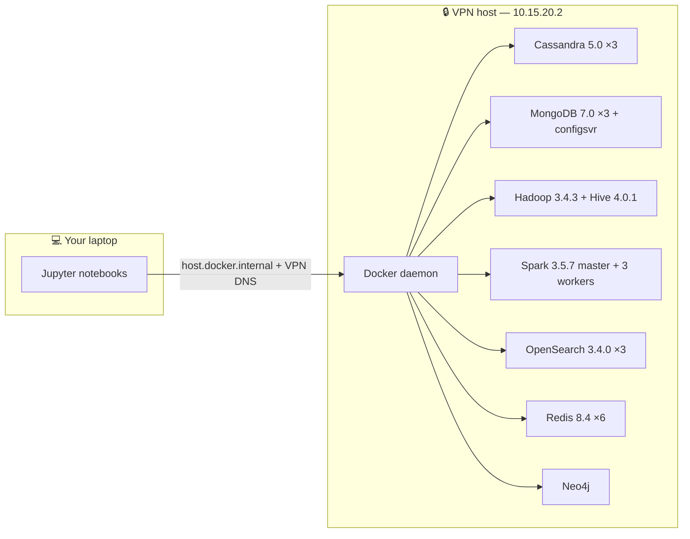
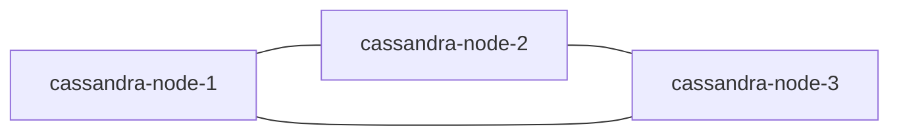
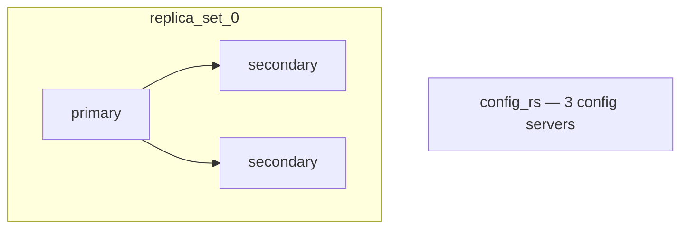
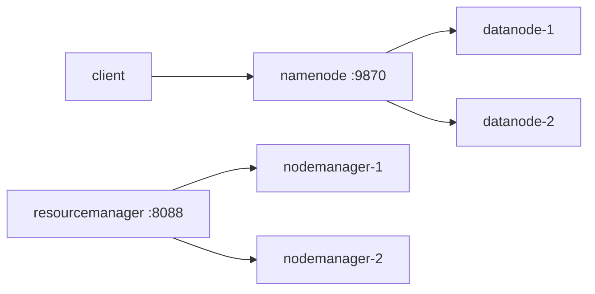
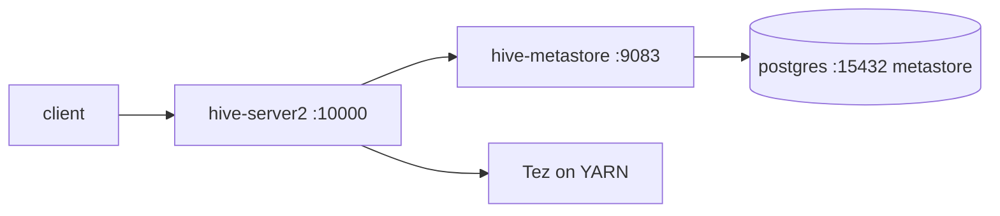
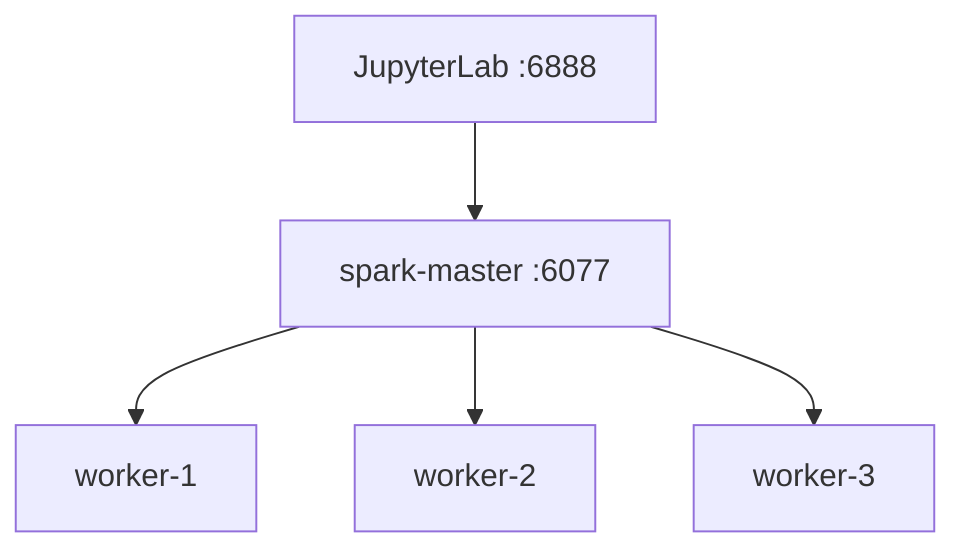
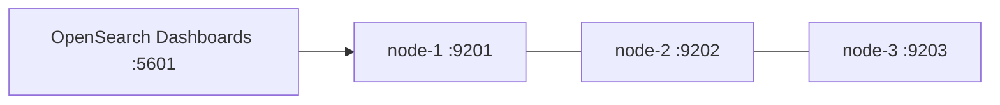
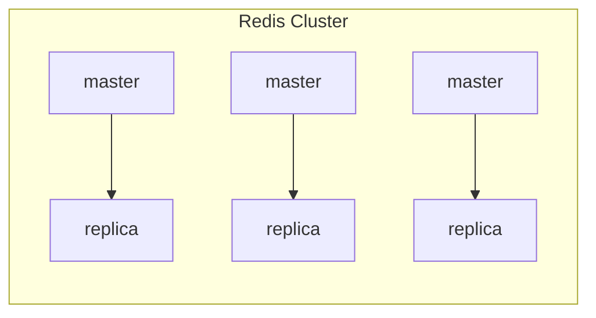

<div align="center">

# 🗄️ Non-Relational DBs — Labs Setup

**One repository. Eight distributed systems.**

Spin up **Cassandra · MongoDB · Hadoop · Hive · Spark · OpenSearch · Redis · Neo4j** as production-shaped, multi-node clusters — over a VPN — from Jupyter notebooks that *generate their own* Docker Compose files.

[](https://www.python.org/)
[](https://docs.docker.com/compose/)
[](https://jupyter.org/)
[](https://docs.astral.sh/uv/)

</div>

---

## Table of contents

1. [What is this?](#what-is-this)
2. [Architecture at a glance](#architecture-at-a-glance)
3. [Prerequisites](#prerequisites)
4. [Quickstart](#quickstart)
5. [Modules](#modules)
   - [Cassandra](#cassandra)
   - [MongoDB](#mongodb)
   - [Hadoop](#hadoop)
   - [Hive](#hive)
   - [Spark](#spark)
   - [OpenSearch](#opensearch)
   - [Redis](#redis)
   - [Neo4j](#neo4j)
6. [The VPN model](#the-vpn-model)
7. [Cluster lifecycle & cleanup](#cluster-lifecycle--cleanup)
8. [Security notes](#security-notes)
9. [Troubleshooting](#troubleshooting)
10. [Conventions & contributing](#conventions--contributing)

---

## What is this?

`labs-setup` is the hands-on companion to the **Non-Relational Databases** course. It replaces *"download this tarball, then run these forty commands"* with one repeatable pattern:

> **Every technology follows the same shape:** an `*_infra.ipynb` notebook that *programmatically builds* a `*-cluster.docker-compose.yml` and boots the cluster, and a matching `*_lab.ipynb` notebook that connects to it and teaches the fundamentals.

You never hand-edit a raw Compose file. The notebooks generate them from Python constants, so every topology, port, and credential is declared in one readable place — change the constants, re-run, and the cluster is rebuilt.

| | |
|---|---|
| **Language / tooling** | Python 3.13 · Jupyter · uv · Docker Compose v2 |
| **Databases & engines** | Cassandra 5.0 · MongoDB 7.0 · Hadoop 3.4.3 · Hive 4.0.1 · Spark 3.5.7 · OpenSearch 3.4.0 · Redis 8.4 · Neo4j (ubi9) |
| **Topology** | Distributed, multi-node, over a VPN (`mavasbel.vpn.itam.mx`) |
| **Learning model** | `infra` (deploy) → `lab` (learn) notebook pairs |

---

## Architecture at a glance

Every cluster runs on a single VPN host. Each node is a container that advertises a *hostname* on the VPN domain and a *distinct published port* on the host's single IP (`10.15.20.2`), so multiple nodes coexist on one machine while still behaving like a real multi-host network.



### Module map

| Module | Image | Nodes | Infra notebook | Lab notebook |
|---|---|---|---|---|
| Cassandra | `cassandra:5.0` | 3 | `cassandra_infra.ipynb` | `cassandra_lab.ipynb` |
| MongoDB | `mongo:7.0` | 3 + 3 config servers | `mongodb_infra.ipynb` · `mongodb_infra_configsvr.ipynb` | `mongodb_lab.ipynb` |
| Hadoop | `apache/hadoop:3.4.3` | namenode + 2 datanodes | `hadoop_infra.ipynb` | `hadoop_lab.ipynb` |
| Hive | `apache/hive:4.0.1` + `postgres:18` | metastore + server2 | `hive_infra.ipynb` | `hive_lab.ipynb` |
| Spark | `apache/spark:3.5.7-…` + custom | master + 3 workers + JupyterLab | `spark_infra.ipynb` | `spark_examples.ipynb` |
| OpenSearch | `opensearchproject/opensearch:3.4.0` | 3 + dashboards | `opensearch_infra.ipynb` | `opensearch_lab.ipynb` |
| Redis | `redis:8.4.0-bookworm` | 6 (cluster) | `redis_infra.ipynb` | `redis_lab.ipynb` |
| Neo4j | `neo4j:ubi9` | 1 (+ APOC, GDS) | `neo4j_infra.ipynb` | `neo4j_lab.ipynb` |

---

## Prerequisites

| Requirement | Version / note |
|---|---|
| Docker | Docker Desktop with **Compose v2** (`docker compose` subcommand) — confirm your installed version, any recent Docker Desktop works |
| Python | **3.13** (see `.python-version`) |
| uv | latest (`pip install uv` or `winget install astral-sh.uv`) |
| Jupyter | installed via `uv sync` (pulls `ipykernel`) |
| VPN access | membership to the course VPN, domain `mavasbel.vpn.itam.mx` |
| Resources | ≥ 16 GB RAM recommended — Hadoop + Spark concurrently are heavy |

> **Why the VPN?** The clusters use hostnames in a private domain and a fixed internal DNS (`10.15.20.1`). Without the VPN, cross-node name resolution fails.

---

## Quickstart

```bash
git clone https://github.com/non-relational-dbs/labs-setup.git
cd labs-setup

# 1. Create the virtual environment with the exact pinned dependencies
uv sync

# 2. Launch Jupyter
uv run jupyter lab
```

Then, for each module: **run `*_infra.ipynb` first**, wait until the cluster reports healthy, then open the matching `*_lab.ipynb`.

---

## Modules

### Cassandra

A 3-node Apache Cassandra 5.0 cluster with **SSL/TLS between nodes** — the infra notebook generates a cluster CA and per-node certificates before booting.

| Node | Gossip | RPC | SSL gossip | JMX |
|---|---|---|---|---|
| `cassandra-node-1` | 7001 | 9041 | 7501 | 7201 |
| `cassandra-node-2` | 7002 | 9042 | 7502 | 7202 |
| `cassandra-node-3` | 7003 | 9043 | 7503 | 7203 |

- Credentials: `cassandra` / `cassandra`
- Workdir: `/var/lib/cassandra` · `cassandra.yaml`, `cassandra-rackdc.properties` are provided
- JDBC access via the bundled `cassandra-jdbc-wrapper-4.16.1-bundle.jar`



The lab covers keyspace creation, insert/query, token-range placement across nodes, and an ORM-like session helper.

### MongoDB

A 3-node **replica set** (`replica_set_0`), plus a separate notebook that deploys **only the config servers** (`config_rs`) — the building blocks of sharding.

| Node | Port |
|---|---|
| `mongodb-node-1` | 27011 |
| `mongodb-node-2` | 27012 |
| `mongodb-node-3` | 27013 |
| `config-server-1 … 3` (`config_rs`) | 27011 … 27013 |

- Root credentials: `admin` / `admin` (db `admin`)
- Workdir: `/data/db`
- `mongo-express.config.js` is bundled as an *optional* admin-UI add-on (not wired into the generated compose file by default)



The lab covers CRUD, replica-set connection semantics, and `explain()` with/without indexes.

### Hadoop

Classic HDFS + YARN: a namenode, a resourcemanager, and 2 datanodes with replication factor 2.

| Component | Ports |
|---|---|
| namenode | RPC 8020 · web UI 9870 |
| resourcemanager | web UI 8088 · scheduler 8030 · tracker 8031 · app-manager 8032 · admin 8033 |
| datanode 1 / 2 | web UI 9864 / 9874 · transfer 9866 / 9876 · IPC 6867 / 6877 |
| nodemanager 1 / 2 | web UI 8050 / 8060 · RPC 8051 / 8061 |
| MapReduce | job history 10020 · log server 19888 |

- Workdir `/opt/hadoop/work-dir` · name dir `/opt/hadoop/dfs/name` · data dir `/opt/hadoop/dfs/data`



The lab walks a full **MapReduce** job: upload to HDFS, inspect block replication across datanodes, generate mapper/reducer scripts, and validate the count.

### Hive

Hive 4.0.1 with a PostgreSQL 18 metastore, running on **Tez** — the infra notebook loads the Tez distribution into HDFS.

| Component | Hostname | Port |
|---|---|---|
| metastore DB (Postgres) | `hive-metastore-db` | 15432 |
| Hive metastore | `hive-metastore` | 9083 |
| HiveServer2 | `hive-server2` | 10000 |
| HiveServer2 Web UI | `hive-server2` | 10002 |

- Postgres: `hive` / `hive`, db `metastore`
- Bundled: `apache-tez-0.10.2-bin.tar.gz` (loaded to HDFS) · `postgresql-42.7.10.jar`



The lab creates external tables, runs aggregations, and explores partitioning — all queried through the PyHive client.

### Spark

Spark 3.5.7 (Scala 2.12, Java 17, Python 3) with a **custom-built** JupyterLab image and a **venv-pack** job environment (for shipping self-contained Python virtualenvs to workers). Delta Lake and Apache Iceberg jars are bundled.

| Component | Port |
|---|---|
| spark-master | 6077 (RPC) · 6080 (web UI) |
| spark-worker 1 / 2 / 3 | 6081 / 6082 / 6083 (web UI) |
| JupyterLab | 6888 · 4040 (Spark monitor) |

- Base image `apache/spark:3.5.7-scala2.12-java17-python3-ubuntu`
- Custom images: `dockerfile.spark-jupyter`, `dockerfile.spark-job-venv`
- Jars: `delta-spark_2.12-3.2.0.jar`, `iceberg-spark-runtime-3.5_2.12-1.6.1.jar`
- Shared workspace `/opt/spark/shared-workspace`



### OpenSearch

A 3-node OpenSearch 3.4.0 cluster (with the performance analyzer) plus OpenSearch Dashboards.

| Node | REST API | Perf analyzer |
|---|---|---|
| `opensearch-node-1` | 9201 | 16281 |
| `opensearch-node-2` | 9202 | 16282 |
| `opensearch-node-3` | 9203 | 16283 |

- Dashboards: `5601`
- Admin: `admin` / `OpenSearchP455`
- Workdir `/usr/share/opensearch/data`



### Redis

A **6-node Redis Cluster** (3 masters + 3 replicas).

| Node | Port | Bus port |
|---|---|---|
| `redis-node-1` … `redis-node-6` | 6381 … 6386 | 16381 … 16386 |

- Credentials: `redis` / `redis`
- Workdir `/data`



### Neo4j

A single Neo4j node with the **APOC** and **Graph Data Science** (`graph-data-science`) plugins pre-loaded.

| Port | Purpose |
|---|---|
| 7687 | Bolt |
| 7474 | Browser UI |

- Credentials: `neo4j` / `password`
- Image `neo4j:ubi9` · unrestricted procedures `apoc.*, gds.*`

The lab covers node/relationship creation and property-bearing relationship patterns.

---

## The VPN model

All clusters share one pattern so a single host can emulate a multi-machine network:

| Concept | Value |
|---|---|
| VPN domain | `mavasbel.vpn.itam.mx` |
| Host IP | `10.15.20.2` |
| Internal DNS | `10.15.20.1` |
| Host alias inside notebooks | `host.docker.internal` |

**How it works:** each node is a container whose `hostname` lives on the VPN domain, but which *publishes* a distinct port on the single host IP. Cross-node traffic resolves via the domain/DNS; you connect from your laptop via `host.docker.internal` on the published ports.

> **⚠ Known inconsistency:** Cassandra (`cassandra_infra.ipynb`, `cassandra_lab.ipynb`) and the MongoDB config-server notebook (`mongodb_infra_configsvr.ipynb`) use a *different* subnet — host `10.15.30.2`, DNS `10.15.30.1` — while all other modules use `10.15.20.x`. Everything works, but this is on the list to unify.

To move a cluster to a different VPN, edit the `*_VPN_DOMAIN`, `DOCKER_DNS`, and `*_NODE_IPS` constants at the top of each notebook and re-run.

---

## Cluster lifecycle & cleanup

Every infra notebook starts with a `*_START_FROM_SCRATCH` flag:

| Value | Behavior |
|---|---|
| `True` | tears down the previous stack (`docker compose … down -v`), wipes mount directories, regenerates the `*-cluster.docker-compose.yml`, and boots fresh |
| `False` | reuses existing state |

The generated `*.docker-compose.yml` files are **git-ignored** and recreated on every run — never edit them by hand; edit the notebook constants instead.

To stop a cluster: run the `Stop` cell in its infra notebook, or:

```bash
docker compose -f <name>.docker-compose.yml down -v
```

---

## Security notes

- **Default credentials are course-local and public** (mongo `admin/admin`, neo4j `neo4j/password`, redis `redis/redis`, opensearch `admin/OpenSearchP455`, cassandra `cassandra/cassandra`). Do **not** expose these clusters to the public internet.
- **Spark JupyterLab token** currently defaults to `""` (no auth) and is published on port 6888. Set `JUPYTER_LAB_TOKEN` to a strong value before exposing it beyond the VPN.

---

## Troubleshooting

| Symptom | Cause | Fix |
|---|---|---|
| Nodes can't see each other | DNS/subnet mismatch | Confirm VPN is connected; check `DOCKER_DNS` + node IPs |
| Port already in use | Stale container / another module | `docker compose … down -v`, or set `*_START_FROM_SCRATCH = True` |
| Hive/Tez errors | Tez not loaded in HDFS | Re-run the "Load dist-lib" cell in `hive_infra.ipynb` |
| Spark jobs fail on workers | Missing venv-pack env | Re-run `spark_infra.ipynb` build cells (`spark-jupyter`, `spark-job-venv`) |
| Cassandra cluster won't form | SSL/rackdc misconfig | Re-run cert-generation cells before start |

---

## Conventions & contributing

- Notebook pairs: `<tech>_infra.ipynb` (deploy) + `<tech>_lab.ipynb` (learn).
- Constants live at the top of each notebook; compose files are generated, not committed.
- Credentials are course-local defaults (documented above) — not for production use.
- Student homework notebooks are intentionally **not** in this repository (they live in the course's internal grading repo).
